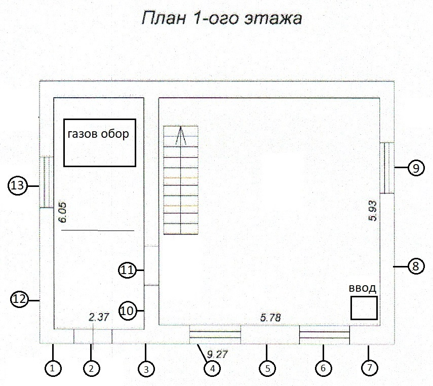
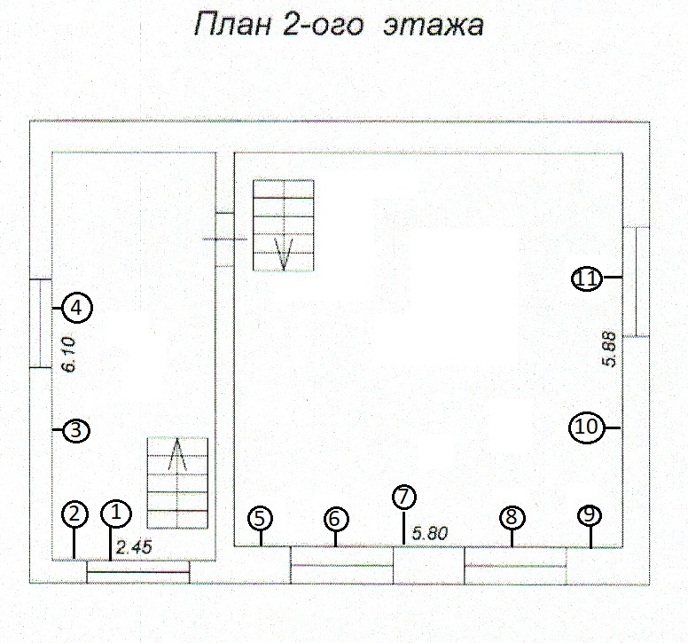
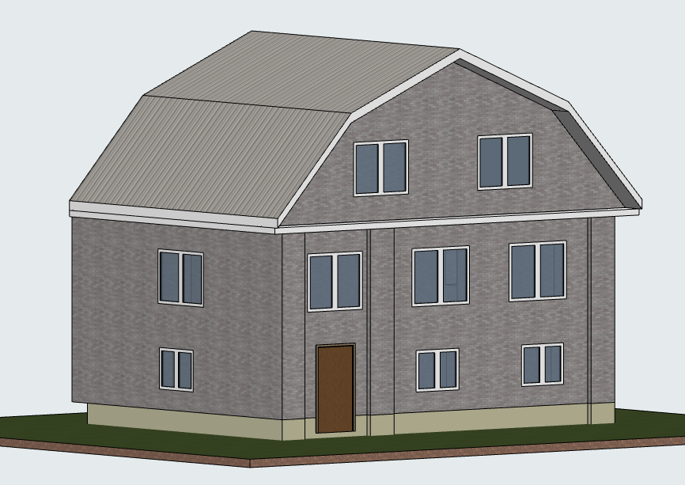
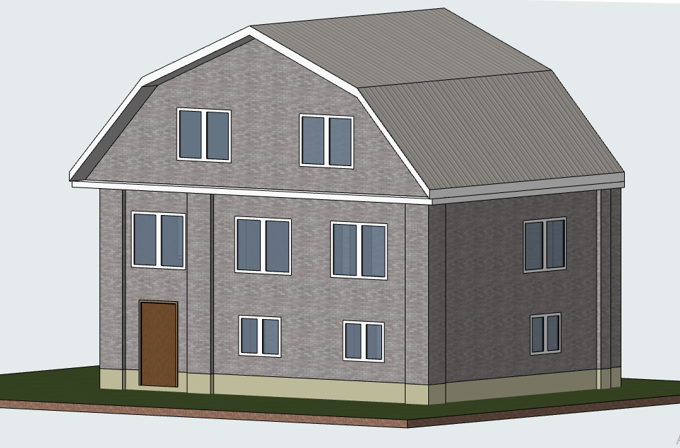
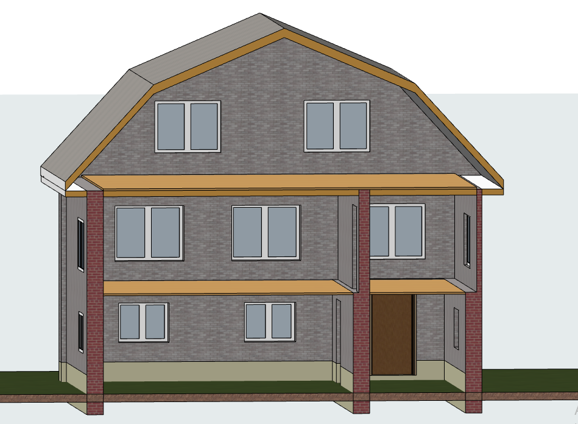

# Планы

<a href="план_первого_этажа.pdf"><i>План первого этажа</i></a>

# Замеры

Ширина фундамента - 45 см
Указатели на размеры стоят с той стороны, с которой производилось измерение 

1. С левого угла до двери - 63.5 + 40.5 = 104 см
2. Дверной проем - 101 х 280 см
* Высота дверного проема от верхней точки до фундамента - 170.5 см
3. От проема до окна - 40.5 + 66.0 + 70.5 = 177 см
4. Окно - 119 х 100 см
* Высота от фундамента до окна - 48.5 см
5. От окна до окна - 174 см
6.  Окно - 117 х 101 см
* Высота от фундамента до окна - 48.5 см
7. От окна до угла - 68 + 65.5 = 133.5 см
8. От угла до окна - 64.5 + 338 = 402.5 см
9. Окно 117 х 101 см
* Высота от фундамента до окна - 48 см
10. Расстояние до проема двери - 114 см
11. Дверной проем - 113 х 213 см
* Высота дверного проема от верхней точки до фундамента - 163 см
* От низа балки проема до досок на потолке - 35 см
* Высота балки - 11 см
* От балки до досок - 35 - 11 = 24 см
* От кладки до досок - 14 см
12. От угла до окна - 316.5 см
13. Окно - 120 х 97.5 см
* Высота от фундамента до окна - 48.5 см

## Терраска
* Высота терраски от кладки до пола - 260 см

1. Окно 153 х 133 см 
* Высота сверху кладки до окна - 49 см
2. От края окна до угла - 53.5 см
3. От угла до края бокового окна - 256 см
4. Окно - 162 х 129 см
* Высота сверху кладки до окна - 49 см

## Жилое помещение
* Высота от досок пола до потолка - 240 см
5. От стены до окна - 92 см
6. Окно - 160 х 140 см
* Высота от потолка до окна - 36 см
7. Расстояние между окнами - 110 см
8. Окно - 160 х 140 см
* Высота от потолка до окна - 36 см
9. Расстояние от окна до угла - 90 см
10. Расстояние от угла до окна - 320 см
11. Окно 164 х 134 см

# Макеты
    

